# Dokumentacja projekt bazy danych 2024

## Zespół
 - Błażej Naziemiec - 33%
 - Dawid Żak - 33%
 - Szymon Żuk - 33%

Grupa 10, wtorek 18:30

## Role

W bazie danych utworzone są następujące role:

- Administrator
- Wykładowca
- Tłumacz
- Student
- DyrektorSzkoły
- Księgowy

## Uprawnienia

### Administrator

Rola `Administrator` ma następujące uprawnienia:

- Może dodawać, zmieniać i usuwać dane dla: użytkowników
- Może dodawać, zmieniać i usuwać dane dla: pracowników
- Może dodawać, zmieniać i usuwać dane dla: webinarów
- Może dodawać, zmieniać i usuwać dane dla: kursów
- Może dodawać, zmieniać i usuwać dane dla: studiów
- Może dodawać, zmieniać i usuwać dane dla: zamówień
- Może dodawać, zmieniać i usuwać dane dla: szczegółów zamówień
- Może przeglądać dane dla: zamówień
- Może przeglądać dane dla: szczegółów zamówień

```sql
GRANT INSERT, UPDATE, DELETE ON Users TO Administrator;
GRANT INSERT, UPDATE, DELETE ON Employees TO Administrator;
GRANT INSERT, UPDATE, DELETE ON Webinars TO Administrator;
GRANT INSERT, UPDATE, DELETE ON Courses TO Administrator;
GRANT INSERT, UPDATE, DELETE ON Studies TO Administrator;
GRANT INSERT, UPDATE, DELETE ON Orders TO Administrator;
GRANT INSERT, UPDATE, DELETE ON OrderDetails TO Administrator;
GRANT SELECT ON Orders TO Administrator;
GRANT SELECT ON OrderDetails TO Administrator;
```

### Wykładowca

Rola `Wykładowca` ma następujące uprawnienia:

- Może przeglądać dane: studentów
- Może przeglądać dane: zakupionych webinarów przez studentów
- Może przeglądać dane: zaliczonych modułów kursów
- Może przeglądać dane: zaliczonych lekcji kursów
- Może przeglądać dane: zaliczonych webinarów
- Może przeglądać dane: zaliczonych lekcji studiów

```sql
GRANT SELECT ON Students TO Lecturer;
GRANT SELECT ON StudentBoughtWebinars TO Lecturer;
GRANT SELECT ON CourseModulesPassed TO Lecturer;
GRANT SELECT ON CourseLessonsPassed TO Lecturer;
GRANT SELECT ON WebinarsPassed TO Lecturer;
GRANT SELECT ON StudiesLessonPassed TO Lecturer;
```

### Tłumacz

Rola `Tłumacz` ma następujące uprawnienia:

- Może przeglądać dane: webinarów
- Może przeglądać dane: kursów
- Może przeglądać dane: studiów

```sql
GRANT SELECT ON Webinars TO Translator;
GRANT SELECT ON Courses TO Translator;
GRANT SELECT ON Studies TO Translator;
```

### Student

Rola `Student` ma następujące uprawnienia:

- Może przeglądać dane dla: webinarów
- Może przeglądać dane dla: kursów
- Może przeglądać dane dla: studiów
- Może przeglądać dane dla: zakupionych webinarów przez studentów
- Może przeglądać dane dla: zaliczonych modułów kursów
- Może przeglądać dane dla: zaliczonych lekcji kursów
- Może przeglądać dane dla: zaliczonych webinarów
- Może przeglądać dane dla: zaliczonych lekcji studiów

```sql
GRANT SELECT ON Webinars TO Student;
GRANT SELECT ON Courses TO Student;
GRANT SELECT ON Studies TO Student;
GRANT SELECT ON StudentBoughtWebinars TO Student;
GRANT SELECT ON CourseModulesPassed TO Student;
GRANT SELECT ON CourseLessonsPassed TO Student;
GRANT SELECT ON WebinarsPassed TO Student;
GRANT SELECT ON StudiesLessonPassed TO Student;
```

### DyrektorSzkoły

Rola `DyrektorSzkoły` ma następujące uprawnienia:

- Ma pełne uprawnienia (dodawanie, zmienianie, usuwanie, przeglądanie) do danych dla: użytkowników
- Ma pełne uprawnienia (dodawanie, zmienianie, usuwanie, przeglądanie) do danych dla: pracowników
- Ma pełne uprawnienia (dodawanie, zmienianie, usuwanie, przeglądanie) do danych dla: webinarów
- Ma pełne uprawnienia (dodawanie, zmienianie, usuwanie, przeglądanie) do danych dla: kursów
- Ma pełne uprawnienia (dodawanie, zmienianie, usuwanie, przeglądanie) do danych dla: studiów
- Ma pełne uprawnienia (dodawanie, zmienianie, usuwanie, przeglądanie) do danych dla: zamówień
- Ma pełne uprawnienia (dodawanie, zmienianie, usuwanie, przeglądanie) do danych dla: szczegółów zamówień

```sql
GRANT ALL ON Users TO SchoolDirector;
GRANT ALL ON Employees TO SchoolDirector;
GRANT ALL ON Webinars TO SchoolDirector;
GRANT ALL ON Courses TO SchoolDirector;
GRANT ALL ON Studies TO SchoolDirector;
GRANT ALL ON Orders TO SchoolDirector;
GRANT ALL ON OrderDetails TO SchoolDirector;
```

### Księgowy

Rola `Księgowy` ma następujące uprawnienia:

- Może przeglądać dane dla: zamówień
- Może przeglądać dane dla: szczegółów zamówień

```sql
GRANT SELECT ON Orders TO Accountant;
GRANT SELECT ON OrderDetails TO Accountant;
```

## Diagram bazy danych


## Opis tabel

- **Users**: Przechowuje informacje o użytkownikach.
    - **Klucz podstawowy**: UserID
    - **Pozostałe pola tabeli**:
        - UserName: Nazwa użytkownika
        - Password: Hasło użytkownika
        - Email: Adres email użytkownika
        
        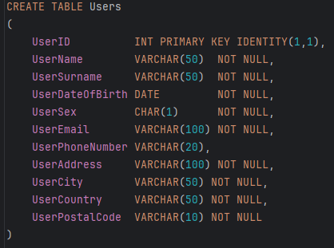

- **Languages**: Przechowuje informacje o językach.
    - **Klucz podstawowy**: LanguageID
    - **Pozostałe pola tabeli**:
        - LanguageName: Nazwa języka
        
        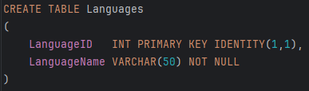

- **CurrencyRates**: Przechowuje kursy walut.
    - **Klucz podstawowy**: CurrencyRateID
    - **Pozostałe pola tabeli**:
        - CurrencyCode: Kod waluty
        - Rate: Kurs waluty
        
        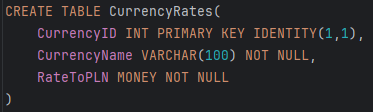

- **EmployeeTypes**: Przechowuje typy pracowników.
    - **Klucz podstawowy**: EmployeeTypeID
    - **Pozostałe pola tabeli**:
        - TypeName: Nazwa typu pracownika
        
        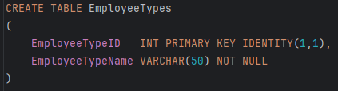

- **Employees**: Przechowuje informacje o pracownikach.
    - **Klucz podstawowy**: EmployeeID
    - **Klucz obcy**: EmployeeTypeID (z tabeli EmployeeTypes)
    - **Pozostałe pola tabeli**:
        - FirstName: Imię pracownika
        - LastName: Nazwisko pracownika
        
        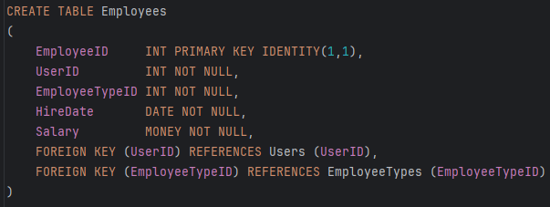

- **TeachingLanguages**: Przechowuje informacje o językach, w których uczą pracownicy.
    - **Klucz podstawowy**: TeachingLanguageID
    - **Klucz obcy**: EmployeeID (z tabeli Employees), LanguageID (z tabeli Languages)
    - **Pozostałe pola tabeli**:
        - ProficiencyLevel: Poziom biegłości
        
        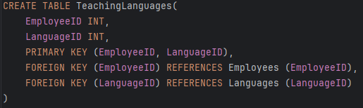

- **Students**: Przechowuje informacje o studentach.
    - **Klucz podstawowy**: StudentID
    - **Pozostałe pola tabeli**:
        - FirstName: Imię studenta
        - LastName: Nazwisko studenta
        
        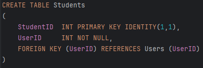

- **StudyingLanguages**: Przechowuje informacje o językach, w których uczą się studenci.
    - **Klucz podstawowy**: StudyingLanguageID
    - **Klucz obcy**: StudentID (z tabeli Students), LanguageID (z tabeli Languages)
    - **Pozostałe pola tabeli**:
        - ProficiencyLevel: Poziom biegłości
        
        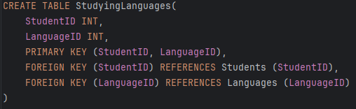

- **TranslatingLanguages**: Przechowuje informacje o językach, które tłumaczą pracownicy.
    - **Klucz podstawowy**: TranslatingLanguageID
    - **Klucz obcy**: EmployeeID (z tabeli Employees), LanguageID (z tabeli Languages)
    - **Pozostałe pola tabeli**:
        - ProficiencyLevel: Poziom biegłości
        
        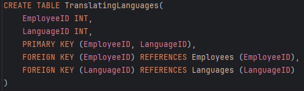

- **Webinars**: Przechowuje informacje o webinarach.
    - **Klucz podstawowy**: WebinarID
    - **Pozostałe pola tabeli**:
        - WebinarName: Nazwa webinaru
        - Description: Opis webinaru
        
        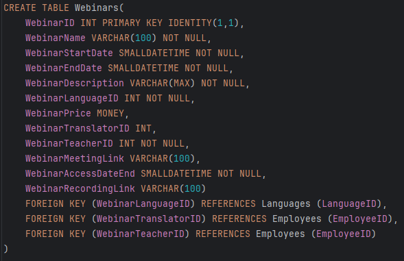

- **StudentBoughtWebinars**: Przechowuje informacje o zakupionych webinarach przez studentów.
    - **Klucz podstawowy**: StudentBoughtWebinarID
    - **Klucz obcy**: StudentID (z tabeli Students), WebinarID (z tabeli Webinars)
    - **Pozostałe pola tabeli**:
        - PurchaseDate: Data zakupu
        
        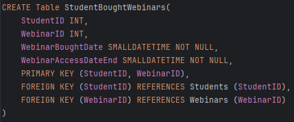

- **Cities**: Przechowuje informacje o miastach.
    - **Klucz podstawowy**: CityID
    - **Pozostałe pola tabeli**:
        - CityName: Nazwa miasta
        
        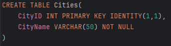

- **UserAvailableCities**: Przechowuje informacje o dostępnych miastach dla użytkowników.
    - **Klucz podstawowy**: UserAvailableCityID
    - **Klucz obcy**: UserID (z tabeli Users), CityID (z tabeli Cities)
    - **Pozostałe pola tabeli**:
        - AvailabilityStatus: Status dostępności
        
        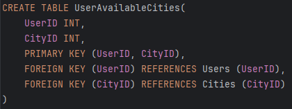

- **Courses**: Przechowuje informacje o kursach.
    - **Klucz podstawowy**: CourseID
    - **Pozostałe pola tabeli**:
        - CourseName: Nazwa kursu
        - Description: Opis kursu
        
        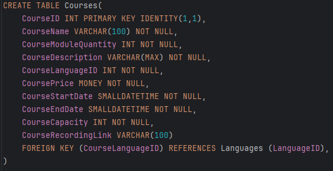

- **CourseModuleMeetingTypes**: Przechowuje typy spotkań modułów kursów.
    - **Klucz podstawowy**: CourseModuleMeetingTypeID
    - **Pozostałe pola tabeli**:
        - MeetingTypeName: Nazwa typu spotkania
        
        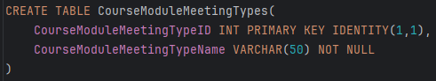

- **CourseModules**: Przechowuje informacje o modułach kursów.
    - **Klucz podstawowy**: CourseModuleID
    - **Klucz obcy**: CourseID (z tabeli Courses)
    - **Pozostałe pola tabeli**:
        - ModuleName: Nazwa modułu
        - Description: Opis modułu
        
        

- **CourseLessonMeetingTypes**: Przechowuje typy spotkań lekcji kursów.
    - **Klucz podstawowy**: CourseLessonMeetingTypeID
    - **Pozostałe pola tabeli**:
        - MeetingTypeName: Nazwa typu spotkania
        
        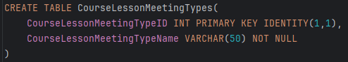

- **CourseLessons**: Przechowuje informacje o lekcjach kursów.
    - **Klucz podstawowy**: CourseLessonID
    - **Klucz obcy**: CourseModuleID (z tabeli CourseModules)
    - **Pozostałe pola tabeli**:
        - LessonName: Nazwa lekcji
        - Description: Opis lekcji
        
        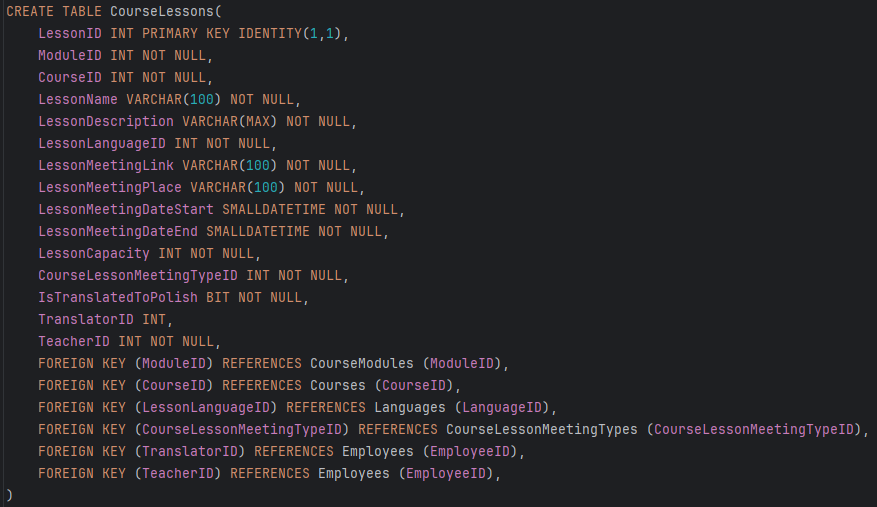

- **CourseModulesPassed**: Przechowuje informacje o zaliczonych modułach kursów przez studentów.
    - **Klucz podstawowy**: CourseModulePassedID
    - **Klucz obcy**: StudentID (z tabeli Students), CourseModuleID (z tabeli CourseModules)
    - **Pozostałe pola tabeli**:
        - PassDate: Data zaliczenia
        
        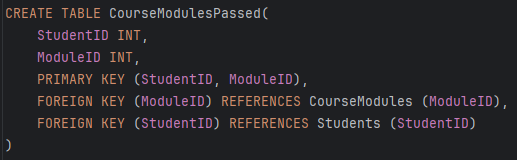

- **CourseLessonsPassed**: Przechowuje informacje o zaliczonych lekcjach kursów przez studentów.
    - **Klucz podstawowy**: CourseLessonPassedID
    - **Klucz obcy**: StudentID (z tabeli Students), CourseLessonID (z tabeli CourseLessons)
    - **Pozostałe pola tabeli**:
        - PassDate: Data zaliczenia
        
        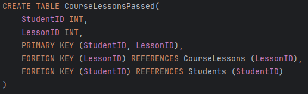

- **WebinarsPassed**: Przechowuje informacje o zaliczonych webinarach przez studentów.
    - **Klucz podstawowy**: WebinarPassedID
    - **Klucz obcy**: StudentID (z tabeli Students), WebinarID (z tabeli Webinars)
    - **Pozostałe pola tabeli**:
        - PassDate: Data zaliczenia
        
        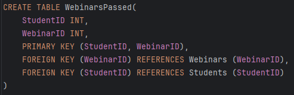

- **Orders**: Przechowuje informacje o zamówieniach.
    - **Klucz podstawowy**: OrderID
    - **Pozostałe pola tabeli**:
        - OrderDate: Data zamówienia
        - TotalAmount: Całkowita kwota
        
        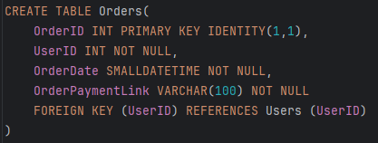

- **OrderDetails**: Przechowuje szczegóły zamówień.
    - **Klucz podstawowy**: OrderDetailID
    - **Klucz obcy**: OrderID (z tabeli Orders)
    - **Pozostałe pola tabeli**:
        - ProductID: ID produktu
        - Quantity: Ilość
        - Price: Cena
        
        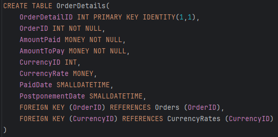

- **OrderWebinars**: Przechowuje informacje o webinarach w zamówieniach.
    - **Klucz podstawowy**: OrderWebinarID
    - **Klucz obcy**: OrderID (z tabeli Orders), WebinarID (z tabeli Webinars)
    - **Pozostałe pola tabeli**:
        - Quantity: Ilość
        
        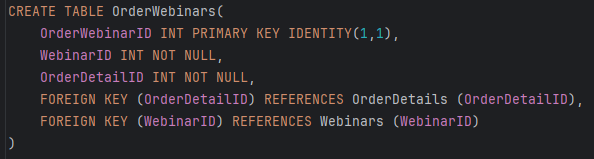

- **OrderCourses**: Przechowuje informacje o kursach w zamówieniach.
    - **Klucz podstawowy**: OrderCourseID
    - **Klucz obcy**: OrderID (z tabeli Orders), CourseID (z tabeli Courses)
    - **Pozostałe pola tabeli**:
        - Quantity: Ilość
        
        

- **Studies**: Przechowuje informacje o studiach.
    - **Klucz podstawowy**: StudyID
    - **Pozostałe pola tabeli**:
        - StudyName: Nazwa studiów
        - Description: Opis studiów
        
        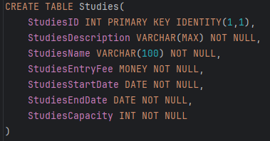

- **Syllabuses**: Przechowuje informacje o sylabusach.
    - **Klucz podstawowy**: SyllabusID
    - **Klucz obcy**: StudyID (z tabeli Studies)
    - **Pozostałe pola tabeli**:
        - SyllabusName: Nazwa sylabusa
        - Description: Opis sylabusa
        
        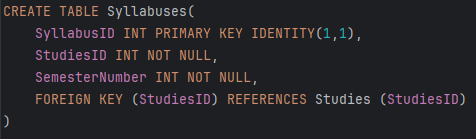

- **Subjects**: Przechowuje informacje o przedmiotach.
    - **Klucz podstawowy**: SubjectID
    - **Pozostałe pola tabeli**:
        - SubjectName: Nazwa przedmiotu
        - Description: Opis przedmiotu
        
        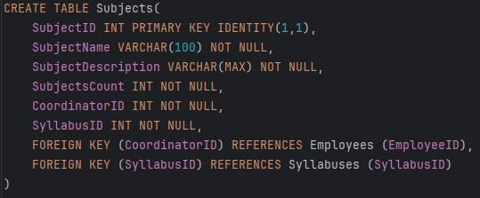

- **StudiesLessonMeetingTypes**: Przechowuje typy spotkań lekcji studiów.
    - **Klucz podstawowy**: StudiesLessonMeetingTypeID
    - **Pozostałe pola tabeli**:
        - MeetingTypeName: Nazwa typu spotkania
        
        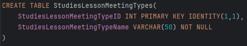

- **StudiesLessons**: Przechowuje informacje o lekcjach studiów.
    - **Klucz podstawowy**: StudiesLessonID
    - **Klucz obcy**: StudyID (z tabeli Studies)
    - **Pozostałe pola tabeli**:
        - LessonName: Nazwa lekcji
        - Description: Opis lekcji
        
        

- **StudiesLessonPassed**: Przechowuje informacje o zaliczonych lekcjach studiów przez studentów.
    - **Klucz podstawowy**: StudiesLessonPassedID
    - **Klucz obcy**: StudentID (z tabeli Students), StudiesLessonID (z tabeli StudiesLessons)
    - **Pozostałe pola tabeli**:
        - PassDate: Data zaliczenia
        
        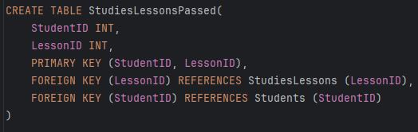

- **Internships**: Przechowuje informacje o praktykach.
    - **Klucz podstawowy**: InternshipID
    - **Pozostałe pola tabeli**:
        - InternshipName: Nazwa praktyki
        - Description: Opis praktyki
        
        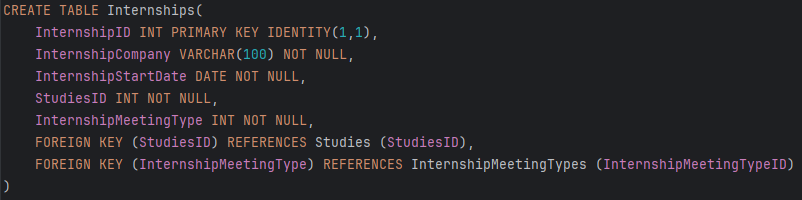

- **InternshipMeetingPassed**: Przechowuje informacje o zaliczonych praktykach przez studentów.
    - **Klucz podstawowy**: InternshipMeetingPassedID
    - **Klucz obcy**: StudentID (z tabeli Students), InternshipID (z tabeli Internships)
    - **Pozostałe pola tabeli**:
        - PassDate: Data zaliczenia
        
        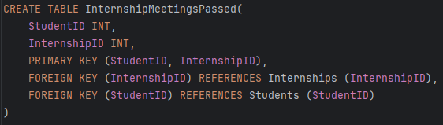

- **OrderStudies**: Przechowuje informacje o studiach w zamówieniach.
    - **Klucz podstawowy**: OrderStudyID
    - **Klucz obcy**: OrderID (z tabeli Orders), StudyID (z tabeli Studies)
    - **Pozostałe pola tabeli**:
        - Quantity: Ilość
        
        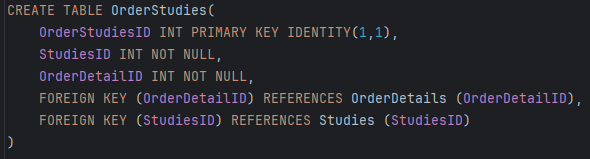

- **RODOSigns**: Przechowuje informacje o zgodach RODO użytkowników.
    - **Klucz podstawowy**: RODOSignID
    - **Klucz obcy**: UserID (z tabeli Users)
    - **Pozostałe pola tabeli**:
        - ConsentDate: Data zgody
        
        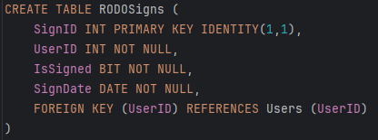


## Widoki

### DebtorsList

Ten widok zapewnia listę dłużników, pokazując kwotę należną dla każdego użytkownika.

```sql
CREATE VIEW DebtorsList AS
SELECT
    Users.UserID,
    Users.UserName,
    Users.UserSurname,
    Orders.OrderID,
    Orders.OrderDate,
    OrderDetails.AmountToPay,
    OrderDetails.AmountPaid,
    (OrderDetails.AmountToPay - OrderDetails.AmountPaid) AS AmountDue
FROM
    Users
INNER JOIN
    Orders ON Users.UserID = Orders.UserID
INNER JOIN
    OrderDetails ON Orders.OrderID = OrderDetails.OrderID
WHERE
    OrderDetails.AmountPaid < OrderDetails.AmountToPay;
```

### PaymentStatus

Ten widok zapewnia status płatności zamówień, wskazując, czy są opłacone, czy oczekujące.

```sql
CREATE VIEW PaymentStatus AS
SELECT
    Orders.OrderID,
    Orders.UserID,
    Users.UserName,
    Users.UserSurname,
    OrderDetails.AmountPaid,
    OrderDetails.AmountToPay,
    CASE
        WHEN OrderDetails.AmountPaid >= OrderDetails.AmountToPay THEN 'Paid'
        ELSE 'Pending'
    END AS PaymentStatus
FROM
    Orders
INNER JOIN
    OrderDetails ON Orders.OrderID = OrderDetails.OrderID
INNER JOIN
    Users ON Orders.UserID = Users.UserID;
```

### RegisteredParticipants

Ten widok zapewnia listę zarejestrowanych uczestników wydarzeń wykładowcy.

```sql
CREATE VIEW RegisteredParticipants AS
SELECT
    Webinars.WebinarID AS EventID,
    Webinars.WebinarName AS EventName,
    Users.UserID,
    Users.UserName,
    Users.UserSurname
FROM
    Webinars
INNER JOIN
    StudentBoughtWebinars ON Webinars.WebinarID = StudentBoughtWebinars.WebinarID
INNER JOIN
    Users ON StudentBoughtWebinars.StudentID = Users.UserID
WHERE
    Webinars.WebinarTeacherID = CURRENT_USER
UNION
SELECT
    Courses.CourseID AS EventID,
    Courses.CourseName AS EventName,
    Users.UserID,
    Users.UserName,
    Users.UserSurname
FROM
    Courses
INNER JOIN
    CourseModulesPassed ON Courses.CourseID = CourseModulesPassed.ModuleID
INNER JOIN
    Users ON CourseModulesPassed.StudentID = Users.UserID
WHERE
    Courses.CourseID IN (SELECT CourseID FROM CourseModules WHERE ModuleID = CourseModulesPassed.ModuleID)
UNION
SELECT
    StudiesLessons.LessonID AS EventID,
    StudiesLessons.LessonName AS EventName,
    Users.UserID,
    Users.UserName,
    Users.UserSurname
FROM
    StudiesLessons
INNER JOIN
    StudiesLessonPassed ON StudiesLessons.LessonID = StudiesLessonPassed.LessonID
INNER JOIN
    Users ON StudiesLessonPassed.StudentID = Users.UserID
WHERE
    StudiesLessons.TeacherID = CURRENT_USER;
```

### EventDetails

Ten widok zapewnia szczegóły wydarzeń dla wykładowcy.

```sql
CREATE VIEW EventDetails AS
SELECT
    Webinars.WebinarID AS EventID,
    Webinars.WebinarName AS EventName,
    Webinars.WebinarStartDate AS EventDate,
    Webinars.WebinarDescription AS EventDescription,
    Webinars.WebinarTeacherID AS LecturerID
FROM
    Webinars
WHERE
    Webinars.WebinarTeacherID = CURRENT_USER
UNION
SELECT
    Courses.CourseID AS EventID,
    Courses.CourseName AS EventName,
    NULL AS EventDate,
    Courses.CourseDescription AS EventDescription,
    NULL AS LecturerID
FROM
    Courses
UNION
SELECT
    StudiesLessons.LessonID AS EventID,
    StudiesLessons.LessonName AS EventName,
    StudiesLessons.LessonMeetingDateStart AS EventDate,
    StudiesLessons.LessonDescription AS EventDescription,
    StudiesLessons.TeacherID AS LecturerID
FROM
    StudiesLessons
WHERE
    StudiesLessons.TeacherID = CURRENT_USER;
```

### AttendanceReports

Ten widok zapewnia raporty frekwencji dla wydarzeń wykładowcy.

```sql
CREATE VIEW AttendanceReports AS
SELECT
    Webinars.WebinarID AS EventID,
    Webinars.WebinarName AS EventName,
    Users.UserID,
    Users.UserName,
    Users.UserSurname,
    WebinarsPassed.PassedDate AS AttendanceDate
FROM
    Webinars
INNER JOIN
    WebinarsPassed ON Webinars.WebinarID = WebinarsPassed.WebinarID
INNER JOIN
    Users ON WebinarsPassed.StudentID = Users.UserID
WHERE
    Webinars.WebinarTeacherID = CURRENT_USER
UNION
SELECT
    Courses.CourseID AS EventID,
    Courses.CourseName AS EventName,
    Users.UserID,
    Users.UserName,
    Users.UserSurname,
    CourseLessonsPassed.PassedDate AS AttendanceDate
FROM
    Courses
INNER JOIN
    CourseLessonsPassed ON Courses.CourseID = CourseLessonsPassed.LessonID
INNER JOIN
    Users ON CourseLessonsPassed.StudentID = Users.UserID
WHERE
    Courses.CourseID IN (SELECT CourseID FROM CourseModules WHERE ModuleID = CourseLessonsPassed.LessonID)
UNION
SELECT
    StudiesLessons.LessonID AS EventID,
    StudiesLessons.LessonName AS EventName,
    Users.UserID,
    Users.UserName,
    Users.UserSurname,
    StudiesLessonPassed.PassedDate AS AttendanceDate
FROM
    StudiesLessons
INNER JOIN
    StudiesLessonPassed ON StudiesLessons.LessonID = StudiesLessonPassed.LessonID
INNER JOIN
    Users ON StudiesLessonPassed.StudentID = Users.UserID
WHERE
    StudiesLessons.TeacherID = CURRENT_USER;
```

### TranslatedEvents

Ten widok zapewnia listę wydarzeń, do których przypisany jest tłumacz.

```sql
CREATE VIEW TranslatedEvents AS
SELECT
    Webinars.WebinarID AS EventID,
    Webinars.WebinarName AS EventName,
    Webinars.WebinarStartDate AS EventDate,
    Webinars.WebinarDescription AS EventDescription,
    Webinars.WebinarTranslatorID AS TranslatorID
FROM
    Webinars
WHERE
    Webinars.WebinarTranslatorID = CURRENT_USER
UNION
SELECT
    Courses.CourseID AS EventID,
    Courses.CourseName AS EventName,
    NULL AS EventDate,
    Courses.CourseDescription AS EventDescription,
    NULL AS TranslatorID
FROM
    Courses
UNION
SELECT
    StudiesLessons.LessonID AS EventID,
    StudiesLessons.LessonName AS EventName,
    StudiesLessons.LessonMeetingDateStart AS EventDate,
    StudiesLessons.LessonDescription AS EventDescription,
    StudiesLessons.TranslatorID AS TranslatorID
FROM
    StudiesLessons
WHERE
    StudiesLessons.TranslatorID = CURRENT_USER;
```

### TranslatorEventDetails

Ten widok zapewnia szczegóły wydarzeń dla tłumacza.

```sql
CREATE VIEW TranslatorEventDetails AS
SELECT
    Webinars.WebinarID AS EventID,
    Webinars.WebinarName AS EventName,
    Webinars.WebinarStartDate AS EventDate,
    Webinars.WebinarDescription AS EventDescription,
    Webinars.WebinarTranslatorID AS TranslatorID
FROM
    Webinars
WHERE
    Webinars.WebinarTranslatorID = CURRENT_USER
UNION
SELECT
    Courses.CourseID AS EventID,
    Courses.CourseName AS EventName,
    NULL AS EventDate,
    Courses.CourseDescription AS EventDescription,
    NULL AS TranslatorID
FROM
    Courses
UNION
SELECT
    StudiesLessons.LessonID AS EventID,
    StudiesLessons.LessonName AS EventName,
    StudiesLessons.LessonMeetingDateStart AS EventDate,
    StudiesLessons.LessonDescription AS EventDescription,
    StudiesLessons.TranslatorID AS TranslatorID
FROM
    StudiesLessons
WHERE
    StudiesLessons.TranslatorID = CURRENT_USER;
```

### AvailableEvents

Ten widok zapewnia listę dostępnych wydarzeń dla studentów.

```sql
CREATE VIEW AvailableEvents AS
SELECT
    Webinars.WebinarID AS EventID,
    Webinars.WebinarName AS EventName,
    Webinars.WebinarStartDate AS EventDate,
    Webinars.WebinarDescription AS EventDescription
FROM
    Webinars
WHERE
    Webinars.WebinarStartDate > CURRENT_DATE
UNION
SELECT
    Courses.CourseID AS EventID,
    Courses.CourseName AS EventName,
    NULL AS EventDate,
    Courses.CourseDescription AS EventDescription
FROM
    Courses
UNION
SELECT
    StudiesLessons.LessonID AS EventID,
    StudiesLessons.LessonName AS EventName,
    StudiesLessons.LessonMeetingDateStart AS EventDate,
    StudiesLessons.LessonDescription AS EventDescription
FROM
    StudiesLessons
WHERE
    StudiesLessons.LessonMeetingDateStart > CURRENT_DATE;
```

### RegisteredEventDetails

Ten widok zapewnia szczegóły zarejestrowanych wydarzeń dla studentów.

```sql
CREATE VIEW
    Webinars.WebinarID AS EventID,
    Webinars.WebinarName AS EventName,
    Webinars.WebinarStartDate AS EventDate,
    Webinars.WebinarDescription AS EventDescription,
    StudentBoughtWebinars.StudentID
FROM
    Webinars
INNER JOIN
    StudentBoughtWebinars ON Webinars.WebinarID = StudentBoughtWebinars.WebinarID
WHERE
    StudentBoughtWebinars.StudentID = CURRENT_USER
UNION
SELECT
    Courses.CourseID AS EventID,
    Courses.CourseName AS EventName,
    NULL AS EventDate,
    Courses.CourseDescription AS EventDescription,
    CourseModulesPassed.StudentID
FROM
    Courses
INNER JOIN
    CourseModulesPassed ON Courses.CourseID = CourseModulesPassed.ModuleID
WHERE
    CourseModulesPassed.StudentID = CURRENT_USER
UNION
SELECT
    StudiesLessons.LessonID AS EventID,
    StudiesLessons.LessonName AS EventName,
    StudiesLessons.LessonMeetingDateStart AS EventDate,
    StudiesLessons.LessonDescription AS EventDescription,
    StudiesLessonPassed.StudentID
FROM
    StudiesLessons
INNER JOIN
    StudiesLessonPassed ON StudiesLessons.LessonID = StudiesLessonPassed.LessonID
WHERE
    StudiesLessonPassed.StudentID = CURRENT_USER;
```

### CompletionStatus

Ten widok zapewnia status ukończenia dla studentów.

```sql
CREATE VIEW CompletionStatus AS
SELECT
    CourseModulesPassed.StudentID,
    CourseModulesPassed.ModuleID AS ItemID,
    'CourseModule' AS ItemType,
    'Passed' AS Status
FROM
    CourseModulesPassed
UNION
SELECT
    CourseLessonsPassed.StudentID,
    CourseLessonsPassed.LessonID AS ItemID,
    'CourseLesson' AS ItemType,
    'Passed' AS Status
FROM
    CourseLessonsPassed
UNION
SELECT
    WebinarsPassed.StudentID,
    WebinarsPassed.WebinarID AS ItemID,
    'Webinar' AS ItemType,
    'Passed' AS Status
FROM
    WebinarsPassed
UNION
SELECT
    StudiesLessonPassed.StudentID,
    StudiesLessonPassed.LessonID AS ItemID,
    'StudiesLesson' AS ItemType,
    'Passed' AS Status
FROM
    StudiesLessonPassed;
```

### StudentPaymentStatus

Ten widok zapewnia status płatności dla studentów.

```sql
CREATE VIEW StudentPaymentStatus AS
SELECT
    Orders.OrderID,
    Orders.UserID,
    Users.UserName,
    Users.UserSurname,
    OrderDetails.AmountPaid,
    OrderDetails.AmountToPay,
    CASE
        WHEN OrderDetails.AmountPaid >= OrderDetails.AmountToPay THEN 'Paid'
        ELSE 'Pending'
    END AS PaymentStatus
FROM
    Orders
INNER JOIN
    OrderDetails ON Orders.OrderID = OrderDetails.OrderID
INNER JOIN
    Users ON Orders.UserID = Users.UserID
WHERE
    Orders.UserID = CURRENT_USER;
```

## Funkcje

### Przechowywanie listy dostępnych webinarów, kursów i studiów

```sql
CREATE VIEW AvailableWebinarsCoursesStudies AS
SELECT WebinarID AS ID, WebinarName AS Name, 'Webinar' AS Type
FROM Webinars
UNION
SELECT CourseID AS ID, CourseName AS Name, 'Course' AS Type
FROM Courses
UNION
SELECT StudiesID AS ID, StudiesName AS Name, 'Studies' AS Type
FROM Studies;
```

### Przechowywanie sylabusów i harmonogramów

```sql
CREATE VIEW SyllabusesAndSchedules AS
SELECT SyllabusID, StudiesID, SemesterNumber
FROM Syllabuses
UNION
SELECT LessonID, StudiesID, LessonMeetingDateStart, LessonMeetingDateEnd
FROM StudiesLessons;
```

### Przechowywanie szczegółów wydarzenia (np. daty, miejsca, linków do spotkań online)

```sql
CREATE VIEW EventDetails AS
SELECT WebinarID AS EventID, WebinarName AS EventName, WebinarStartDate AS StartDate, WebinarEndDate AS EndDate, WebinarMeetingLink AS MeetingLink, WebinarDescription AS Description
FROM Webinars
UNION
SELECT CourseID AS EventID, CourseName AS EventName, NULL AS StartDate, NULL AS EndDate, NULL AS MeetingLink, CourseDescription AS Description
FROM Courses
UNION
SELECT StudiesID AS EventID, StudiesName AS EventName, StudiesStartDate AS StartDate, StudiesEndDate AS EndDate, NULL AS MeetingLink, StudiesDescription AS Description;
```

### Przechowywanie statusu zaliczeń (moduły kursowe, frekwencja na studiach)

```sql
CREATE VIEW CompletionStatus AS
SELECT StudentID, ModuleID AS ItemID, 'CourseModule' AS ItemType, 'Passed' AS Status
FROM CourseModulesPassed
UNION
SELECT StudentID, LessonID AS ItemID, 'CourseLesson' AS ItemType, 'Passed' AS Status
FROM CourseLessonsPassed
UNION
SELECT StudentID, WebinarID AS ItemID, 'Webinar' AS ItemType, 'Passed' AS Status
FROM WebinarsPassed
UNION
SELECT StudentID, LessonID AS ItemID, 'StudiesLesson' AS ItemType, 'Passed' AS Status
FROM StudiesLessonPassed;
```

### Sprawdzanie statusu płatności

```sql
CREATE VIEW PaymentStatus AS
SELECT OrderID, UserID, AmountPaid, AmountToPay,
CASE
    WHEN AmountPaid >= AmountToPay THEN 'Paid'
    ELSE 'Pending'
END AS Status
FROM OrderDetails;
```

### Generowanie raportów finansowych (przychody dla każdego typu wydarzeń)

```sql
CREATE VIEW FinancialReports AS
SELECT 'Webinar' AS EventType, WebinarID AS EventID, SUM(AmountPaid) AS TotalRevenue
FROM OrderWebinars
INNER JOIN OrderDetails ON OrderWebinars.OrderDetailID = OrderDetails.OrderDetailID
GROUP BY WebinarID
UNION
SELECT 'Course' AS EventType, CourseID AS EventID, SUM(AmountPaid) AS TotalRevenue
FROM OrderCourses
INNER JOIN OrderDetails ON OrderCourses.OrderDetailID = OrderDetails.OrderDetailID
GROUP BY CourseID
UNION
SELECT 'Studies' AS EventType, StudiesID AS EventID, SUM(AmountPaid) AS TotalRevenue
FROM OrderStudies
INNER JOIN OrderDetails ON OrderStudies.OrderDetailID = OrderDetails.OrderDetailID
GROUP BY StudiesID;
```

### Wyświetlanie raportu liczby zapisanych osób

```sql
CREATE VIEW EnrollmentReport AS
SELECT 'Webinar' AS EventType, WebinarID AS EventID, COUNT(StudentID) AS EnrollmentCount
FROM StudentBoughtWebinars
GROUP BY WebinarID
UNION
SELECT 'Course' AS EventType, CourseID AS EventID, COUNT(StudentID) AS EnrollmentCount
FROM CourseModulesPassed
GROUP BY CourseID
UNION
SELECT 'Studies' AS EventType, StudiesID AS EventID, COUNT(StudentID) AS EnrollmentCount
FROM StudentStudies
GROUP BY StudiesID;
```

### Tworzenie list obecności oraz raportów dotyczących frekwencji

```sql
CREATE VIEW AttendanceReports AS
SELECT 'CourseLesson' AS EventType, LessonID AS EventID, COUNT(StudentID) AS AttendanceCount
FROM CourseLessonsPassed
GROUP BY LessonID
UNION
SELECT 'StudiesLesson' AS EventType, LessonID AS EventID, COUNT(StudentID) AS AttendanceCount
FROM StudiesLessonPassed
GROUP BY LessonID;
```

### Automatyczne weryfikowanie udziału w wydarzeniach online

```sql
CREATE TRIGGER VerifyOnlineParticipation
ON StudentBoughtWebinars
AFTER INSERT
AS
BEGIN
    UPDATE StudentBoughtWebinars
    SET WebinarAccessDateEnd = DATEADD(DAY, 30, WebinarBoughtDate)
    WHERE WebinarAccessDateEnd IS NULL;
END;
```

### Filtrowanie po rodzaju (webinary, kursy, studia), formie (stacjonarne, online, hybrydowe), języku, dostępności miejsc, cenie

```sql
CREATE VIEW FilteredEvents AS
SELECT WebinarID AS EventID, WebinarName AS EventName, 'Webinar' AS EventType, WebinarLanguageID AS LanguageID, WebinarPrice AS Price, NULL AS Capacity
FROM Webinars
UNION
SELECT CourseID AS EventID, CourseName AS EventName, 'Course' AS EventType, CourseLanguageID AS LanguageID, CoursePrice AS Price, NULL AS Capacity
FROM Courses
UNION
SELECT StudiesID AS EventID, StudiesName AS EventName, 'Studies' AS EventType, NULL AS LanguageID, NULL AS Price, NULL AS Capacity
FROM Studies;
```

## Procedury

### AddUser - Dodaje nowego użytkownika do systemu

```sql
CREATE PROCEDURE AddUser
    @UserName VARCHAR(50),
    @UserSurname VARCHAR(50),
    @UserDateOfBirth DATE,
    @UserSex CHAR(1),
    @UserEmail VARCHAR(100),
    @UserPhoneNumber VARCHAR(20),
    @UserAddress VARCHAR(100),
    @UserCity VARCHAR(50),
    @UserCountry VARCHAR(50),
    @UserPostalCode VARCHAR(10)
AS
BEGIN
    INSERT INTO Users (UserName, UserSurname, UserDateOfBirth, UserSex, UserEmail, UserPhoneNumber, UserAddress, UserCity, UserCountry, UserPostalCode)
    VALUES (@UserName, @UserSurname, @UserDateOfBirth, @UserSex, @UserEmail, @UserPhoneNumber, @UserAddress, @UserCity, @UserCountry, @UserPostalCode);
END;
```

### UpdateUserProfile - Aktualizuje dane profilu użytkownika

```sql
CREATE PROCEDURE UpdateUserProfile
    @UserID INT,
    @UserName VARCHAR(50),
    @UserSurname VARCHAR(50),
    @UserDateOfBirth DATE,
    @UserSex CHAR(1),
    @UserEmail VARCHAR(100),
    @UserPhoneNumber VARCHAR(20),
    @UserAddress VARCHAR(100),
    @UserCity VARCHAR(50),
    @UserCountry VARCHAR(50),
    @UserPostalCode VARCHAR(10)
AS
BEGIN
    UPDATE Users
    SET UserName = @UserName,
        UserSurname = @UserSurname,
        UserDateOfBirth = @UserDateOfBirth,
        UserSex = @UserSex,
        UserEmail = @UserEmail,
        UserPhoneNumber = @UserPhoneNumber,
        UserAddress = @UserAddress,
        UserCity = @UserCity,
        UserCountry = @UserCountry,
        UserPostalCode = @UserPostalCode
    WHERE UserID = @UserID;
END;
```

### DeleteUser - Usuwa użytkownika z systemu

```sql
CREATE PROCEDURE DeleteUser
    @UserID INT
AS
BEGIN
    DELETE FROM Users
    WHERE UserID = @UserID;
END;
```

### AddRole - Dodawanie użytkownikowi nowej roli

```sql
CREATE PROCEDURE AddRole
    @UserID INT,
    @RoleID INT
AS
BEGIN
    INSERT INTO UserRoles (UserID, RoleID)
    VALUES (@UserID, @RoleID);
END;
```

### RemoveRole - Usuwanie użytkownikowi roli

```sql
CREATE PROCEDURE RemoveRole
    @UserID INT,
    @RoleID INT
AS
BEGIN
    DELETE FROM UserRoles
    WHERE UserID = @UserID AND RoleID = @RoleID;
END;
```

### AddEvent - Dodaje nowe wydarzenie (webinar, kurs, studium)

```sql
CREATE PROCEDURE AddEvent
    @EventName VARCHAR(100),
    @EventType VARCHAR(50),
    @EventStartDate DATE,
    @EventEndDate DATE,
    @EventDescription VARCHAR(MAX),
    @EventLanguageID INT,
    @EventPrice MONEY,
    @EventTranslatorID INT,
    @EventTeacherID INT,
    @EventMeetingLink VARCHAR(100)
AS
BEGIN
    IF @EventType = 'Webinar'
    BEGIN
        INSERT INTO Webinars (WebinarName, WebinarStartDate, WebinarEndDate, WebinarDescription, WebinarLanguageID, WebinarPrice, WebinarTranslatorID, WebinarTeacherID, WebinarMeetingLink)
        VALUES (@EventName, @EventStartDate, @EventEndDate, @EventDescription, @EventLanguageID, @EventPrice, @EventTranslatorID, @EventTeacherID, @EventMeetingLink);
    END
    ELSE IF @EventType = 'Course'
    BEGIN
        INSERT INTO Courses (CourseName, CourseDescription, CourseLanguageID, CoursePrice)
        VALUES (@EventName, @EventDescription, @EventLanguageID, @EventPrice);
    END
    ELSE IF @EventType = 'Studies'
    BEGIN
        INSERT INTO Studies (StudiesName, StudiesDescription, StudiesStartDate, StudiesEndDate)
        VALUES (@EventName, @EventDescription, @EventStartDate, @EventEndDate);
    END
END;
```

### UpdateEventDetails - Aktualizuje szczegóły wydarzenia

```sql
CREATE PROCEDURE UpdateEventDetails
    @EventID INT,
    @EventType VARCHAR(50),
    @EventName VARCHAR(100),
    @EventStartDate DATE,
    @EventEndDate DATE,
    @EventDescription VARCHAR(MAX),
    @EventLanguageID INT,
    @EventPrice MONEY,
    @EventTranslatorID INT,
    @EventTeacherID INT,
    @EventMeetingLink VARCHAR(100)
AS
BEGIN
    IF @EventType = 'Webinar'
    BEGIN
        UPDATE Webinars
        SET WebinarName = @EventName,
            WebinarStartDate = @EventStartDate,
            WebinarEndDate = @EventEndDate,
            WebinarDescription = @EventDescription,
            WebinarLanguageID = @EventLanguageID,
            WebinarPrice = @EventPrice,
            WebinarTranslatorID = @EventTranslatorID,
            WebinarTeacherID = @EventTeacherID,
            WebinarMeetingLink = @EventMeetingLink
        WHERE WebinarID = @EventID;
    END
    ELSE IF @EventType = 'Course'
    BEGIN
        UPDATE Courses
        SET CourseName = @EventName,
            CourseDescription = @EventDescription,
            CourseLanguageID = @EventLanguageID,
            CoursePrice = @EventPrice
        WHERE CourseID = @EventID;
    END
    ELSE IF @EventType = 'Studies'
    BEGIN
        UPDATE Studies
        SET StudiesName = @EventName,
            StudiesDescription = @EventDescription,
            StudiesStartDate = @EventStartDate,
            StudiesEndDate = @EventEndDate
        WHERE StudiesID = @EventID;
    END
END;
```

### DeleteEvent - Usuwa wydarzenie z systemu

```sql
CREATE PROCEDURE DeleteEvent
    @EventID INT,
    @EventType VARCHAR(50)
AS
BEGIN
    IF @EventType = 'Webinar'
    BEGIN
        DELETE FROM Webinars
        WHERE WebinarID = @EventID;
    END
    ELSE IF @EventType = 'Course'
    BEGIN
        DELETE FROM Courses
        WHERE CourseID = @EventID;
    END
    ELSE IF @EventType = 'Studies'
    BEGIN
        DELETE FROM Studies
        WHERE StudiesID = @EventID;
    END
END;
```

### CreatePaymentLink - Generuje link do płatności

```sql
CREATE PROCEDURE CreatePaymentLink
    @OrderID INT,
    @PaymentLink VARCHAR(100)
AS
BEGIN
    UPDATE Orders
    SET OrderPaymentLink = @PaymentLink
    WHERE OrderID = @OrderID;
END;
```

### ProcessPaymentResult - Przetwarza wynik płatności (udana/nieudana)

```sql
CREATE PROCEDURE ProcessPaymentResult
    @OrderDetailID INT,
    @AmountPaid MONEY,
    @PaidDate DATE
AS
BEGIN
    UPDATE OrderDetails
    SET AmountPaid = @AmountPaid,
        PaidDate = @PaidDate
    WHERE OrderDetailID = @OrderDetailID;
END;
```

### ApplyPaymentException - Zapisuje wyjątek płatniczy (np. odroczenie)

```sql
CREATE PROCEDURE ApplyPaymentException
    @OrderDetailID INT,
    @PostponementDate DATE
AS
BEGIN
    UPDATE OrderDetails
    SET PostponementDate = @PostponementDate
    WHERE OrderDetailID = @OrderDetailID;
END;
```

### RegisterForEvent - Rejestruje użytkownika na wydarzenie

```sql
CREATE PROCEDURE RegisterForEvent
    @UserID INT,
    @EventID INT,
    @EventType VARCHAR(50)
AS
BEGIN
    IF @EventType = 'Webinar'
    BEGIN
        INSERT INTO StudentBoughtWebinars (StudentID, WebinarID, WebinarBoughtDate, WebinarAccessDateEnd)
        VALUES (@UserID, @EventID, GETDATE(), DATEADD(DAY, 30, GETDATE()));
    END
    ELSE IF @EventType = 'Course'
    BEGIN
        INSERT INTO CourseModulesPassed (StudentID, ModuleID)
        VALUES (@UserID, @EventID);
    END
    ELSE IF @EventType = 'Studies'
    BEGIN
        INSERT INTO StudentStudies (StudentID, StudiesID)
        VALUES (@UserID, @EventID);
    END
END;
```

### CancelRegistration - Anuluje rejestrację na wydarzenie

```sql
CREATE PROCEDURE CancelRegistration
    @UserID INT,
    @EventID INT,
    @EventType VARCHAR(50)
AS
BEGIN
    IF @EventType = 'Webinar'
    BEGIN
        DELETE FROM StudentBoughtWebinars
        WHERE StudentID = @UserID AND WebinarID = @EventID;
    END
    ELSE IF @EventType = 'Course'
    BEGIN
        DELETE FROM CourseModulesPassed
        WHERE StudentID = @UserID AND ModuleID = @EventID;
    END
    ELSE IF @EventType = 'Studies'
    BEGIN
        DELETE FROM StudentStudies
        WHERE StudentID = @UserID AND StudiesID = @EventID;
    END
END;
```

## Triggery

### HandleWebinarPayment
Ten trigger obsługuje płatności za webinary i dodaje studenta do listy zakupionych webinarów, jeśli płatność jest pełna lub odroczona.

```sql
CREATE TRIGGER HandleWebinarPayment
ON OrderDetails
AFTER INSERT, UPDATE
AS
BEGIN
    IF EXISTS (
        SELECT Orders.UserID, Webinars.WebinarID
        FROM inserted
        INNER JOIN Orders
        ON Orders.OrderID = inserted.OrderID
        INNER JOIN OrderWebinars
        ON OrderWebinars.OrderDetailID = inserted.OrderDetailID
        INNER JOIN Webinars
        ON Webinars.WebinarID = OrderWebinars.WebinarID
        WHERE inserted.AmountPaid = inserted.AmountToPay OR inserted.PostponementDate > GETDATE()
        AND WebinarStartDate > GETDATE()
        AND Orders.UserID IN (
            SELECT DISTINCT StudentID FROM StudentBoughtWebinars
            )
       )
    BEGIN
        RAISERROR('Student already bought that webinar', 1, 1)
    END
    ELSE
    BEGIN
        INSERT INTO StudentBoughtWebinars(StudentID, WebinarID, WebinarBoughtDate, WebinarAccessDateEnd)
        (SELECT Orders.UserID as StudentID, Webinars.WebinarID, GETDATE() as WebinarBoughtDate,
                DATEADD(DAY, 30, GETDATE()) as WebinarAccessDateEnd
        FROM inserted
        INNER JOIN Orders
        ON Orders.OrderID = inserted.OrderID
        INNER JOIN OrderWebinars
        ON OrderWebinars.OrderDetailID = inserted.OrderDetailID
        INNER JOIN Webinars
        ON Webinars.WebinarID = OrderWebinars.WebinarID
        WHERE inserted.AmountPaid = inserted.AmountToPay OR inserted.PostponementDate > GETDATE()
        AND WebinarStartDate > GETDATE())
    END
END;
```

### HandleCoursePayment
Ten trigger obsługuje płatności za kursy i dodaje studenta do listy zakupionych kursów, jeśli płatność jest pełna lub odroczona.

```sql
CREATE TRIGGER HandleCoursePayment
ON OrderDetails
AFTER INSERT, UPDATE
AS
BEGIN
    IF EXISTS (
        SELECT Orders.UserID, Courses.CourseID
        FROM inserted
        INNER JOIN Orders
        ON Orders.OrderID = inserted.OrderID
        INNER JOIN OrderCourses
        ON OrderCourses.OrderDetailID = inserted.OrderDetailID
        INNER JOIN Courses
        ON Courses.CourseID = OrderCourses.CourseID
        WHERE inserted.AmountPaid = inserted.AmountToPay OR inserted.PostponementDate > GETDATE()
        AND DATEADD(DAY, 3, GETDATE()) < Courses.CourseStartDate
        AND Orders.UserID IN (
            SELECT DISTINCT StudentID FROM StudentBoughtCourses
            )
       )
    BEGIN
        RAISERROR('Student already bought that course', 1, 1)
    END
    ELSE
    BEGIN
        INSERT INTO StudentBoughtCourses(StudentID, CourseID)
        (SELECT Orders.UserID as StudentID, Courses.CourseID
        FROM inserted
        INNER JOIN Orders
        ON Orders.OrderID = inserted.OrderID
        INNER JOIN OrderCourses
        ON OrderCourses.OrderDetailID = inserted.OrderDetailID
        INNER JOIN Courses
        ON Courses.CourseID = OrderCourses.CourseID
        WHERE inserted.AmountPaid = inserted.AmountToPay OR inserted.PostponementDate > GETDATE()
        AND DATEADD(DAY, 3, GETDATE()) < Courses.CourseStartDate)
    END
END
```

### HandleSessionPayment
Ten trigger obsługuje płatności za sesje studiów i dodaje studenta do listy zakupionych sesji, jeśli płatność jest pełna lub odroczona.

```sql
CREATE TRIGGER HandleSessionPayment
ON OrderDetails
AFTER INSERT, UPDATE
AS
BEGIN
    IF EXISTS (
        SELECT Orders.UserID, StudiesSessions.SessionID
        FROM inserted
        INNER JOIN Orders
        ON Orders.OrderID = inserted.OrderID
        INNER JOIN OrderSessions
        ON OrderSessions.OrderDetailID = inserted.OrderDetailID
        INNER JOIN Courses
        ON Courses.CourseID = OrderSessions.SessionID
        WHERE inserted.AmountPaid = inserted.AmountToPay OR inserted.PostponementDate > GETDATE()
        AND DATEADD(DAY, 3, GETDATE()) < StudiesSessions.SessionStartDay
        AND Orders.UserID IN (
            SELECT DISTINCT StudentID FROM StudentBoughtSessions
            )
       )
    BEGIN
        RAISERROR('Student already bought that session', 1, 1)
    END
    ELSE
    BEGIN
        INSERT INTO StudentBoughtSessions(StudentID, SessionID)
        (SELECT Orders.UserID as StudentID, Courses.CourseID
        FROM inserted
        INNER JOIN Orders
        ON Orders.OrderID = inserted.OrderID
        INNER JOIN OrderSessions
        ON OrderSessions.OrderDetailID = inserted.OrderDetailID
        INNER JOIN StudiesSessions
        ON StudiesSessions.SessionID = OrderSessions.SessionID
        WHERE inserted.AmountPaid = inserted.AmountToPay OR inserted.PostponementDate > GETDATE()
        AND DATEADD(DAY, 3, GETDATE()) < StudiesSessions.SessionStartDate)
    END
END;
```

### HandleStudiesPayment
Ten trigger obsługuje płatności za studia i dodaje studenta do listy zakupionych studiów, jeśli płatność jest pełna lub odroczona.

```sql
CREATE TRIGGER HandleStudiesPayment
ON OrderDetails
AFTER INSERT, UPDATE
AS
BEGIN
    IF EXISTS (
        SELECT Orders.UserID, Studies.StudiesID
        FROM inserted
        INNER JOIN Orders
        ON Orders.OrderID = inserted.OrderID
        INNER JOIN OrderStudies
        ON OrderStudies.OrderDetailID = inserted.OrderDetailID
        INNER JOIN Studies
        ON Studies.StudiesID = OrderStudies.StudiesID
        WHERE inserted.AmountPaid = inserted.AmountToPay OR inserted.PostponementDate > GETDATE()
        AND DATEADD(DAY, 3, Studies.StudiesStartDate) < GETDATE()
        AND Orders.UserID IN (
            SELECT DISTINCT StudentID FROM StudentBoughtSessions
            )
       )
    BEGIN
        RAISERROR('Student already bought that studies', 1, 1)
    END
    ELSE
    BEGIN
        INSERT INTO StudentBoughtSessions(StudentID, StudiesID)
        (SELECT Orders.UserID as StudentID, Studies.StudiesID
        FROM inserted
        INNER JOIN Orders
        ON Orders.OrderID = inserted.OrderID
        INNER JOIN OrderStudies
        ON OrderStudies.OrderDetailID = inserted.OrderDetailID
        INNER JOIN Studies
        ON Studies.StudiesID = OrderStudies.StudiesID
        WHERE inserted.AmountPaid = inserted.AmountToPay OR inserted.PostponementDate > GETDATE()
        AND StudiesStartDate > GETDATE())
    END
END;
```
